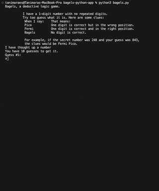

# BAGELS' GAME

This application is a deductive logic game where players must guess a secret number based on clues.

Users get 10 chances to guess the number. After each guess, the game gives you a clue to help figure it out:
- "Pico" means you got a digit right, but it's in the wrong spot.

- "Fermi" means you got a digit right, and it's in the correct spot.

- "Bagels" means none of your digits are in the secret number.

This game is part of the projects presented in the book The big book of small Python Projects and it is available [here](https://inventwithpython.com/bigbookpython/project1.html).

## Technologies

- Python

### Author

[Tanimara Elias Santos](https://github.com/tanimaraeliassantos)

### Version

1.0.0

 
 
